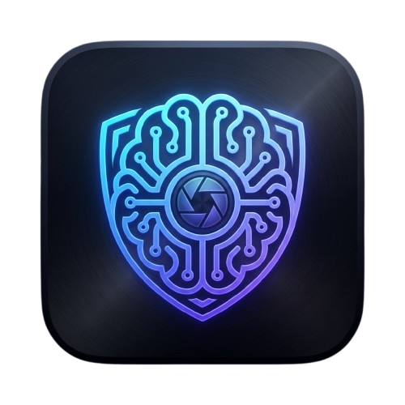

<p align="center">
  
</p>

<h1 align="center">Your Memories</h1>

<p align="center">
  <strong>Your personal AI knowledge base—100% offline</strong>
</p>

<p align="center">
  All your AI conversations from ChatGPT, Claude, Gemini, and more—captured, connected, and searchable.<br/>
  Everything runs on your device. Your data never leaves your machine.
</p>

---

## The Problem

You've had hundreds of conversations with AI assistants. Important insights are scattered across ChatGPT, Claude, Gemini, Perplexity, and Grok. Finding "that one conversation" where you solved a problem takes forever. And syncing to the cloud means giving up control of your data.

## The Solution

**Your Memories** automatically captures your AI conversations and transforms them into a searchable, connected knowledge base—entirely on your device.

| Capture | Extract | Connect |
|---------|---------|---------|
| Automatically imports conversations from your AI assistants as you chat | Extracts key insights, entities, and facts from every conversation | Builds a knowledge graph linking related concepts and ideas |

---

## Features

### Multi-Source Capture
Seamlessly imports from **ChatGPT**, **Claude Desktop**, **Claude (browser)**, **Gemini**, **Perplexity**, and **Grok**. Just chat as normal—Your Memories watches and captures in the background.

### Intelligent Extraction
Local LLMs extract memories, entities (people, concepts, technologies), and facts from every conversation. Creates rich, searchable context automatically.

### Knowledge Graph
Interactive 3D visualization connects entities across all your conversations. See how concepts, people, and ideas relate to each other.

### Memory Chat
Ask questions about your past conversations. Get AI-powered answers grounded in your actual chat history.

### Semantic Search
Find conversations by meaning, not just keywords. Search your entire knowledge base with natural language.

### 100% Local & Private
- All AI processing happens on-device via GGUF models
- Data stored in local SQLite database only
- No cloud sync, no telemetry, no external API calls
- You own your data completely

---

## Quick Start

### Prerequisites
- **Node.js 18+** (recommended)
- **npm**
- macOS (primary), Windows/Linux (available)

### Install & Run

```bash
# Clone the repository
git clone https://github.com/your-org/your-memories.git
cd your-memories

# Install dependencies
npm install

# Start in development mode
npm run dev
```

### Build for Production

```bash
npm run build:mac    # macOS
npm run build:win    # Windows
npm run build:linux  # Linux
```

---

## Architecture

```
src/
├── main/              # Electron main process
│   ├── parsers/       # Chat source parsers (Claude, ChatGPT, etc.)
│   ├── database.ts    # SQLite database layer
│   ├── embeddings.ts  # Local embedding generation
│   ├── llm.ts         # Local LLM integration
│   ├── vision.ts      # Screen capture & OCR
│   └── watcher.ts     # App & file monitoring
├── renderer/          # React UI
│   └── components/    # UI components
└── preload/           # Electron bridge

resources/
├── bin/               # Local inference binaries
└── models/            # GGUF models
```

### Tech Stack

| Layer | Technology |
|-------|------------|
| Desktop | Electron + Vite |
| Frontend | React 19 + TypeScript |
| Styling | Tailwind CSS 4 + Framer Motion |
| 3D Graph | Three.js + react-force-graph-3d |
| Database | better-sqlite3 |
| LLM | node-llama-cpp |
| Embeddings | Xenova Transformers |

---

## Commands

| Command | Description |
|---------|-------------|
| `npm run dev` | Start development server |
| `npm run build` | Typecheck & build |
| `npm run build:mac` | Build macOS package |
| `npm run test` | Run tests |
| `npm run lint` | Run ESLint |
| `npm run format` | Format with Prettier |

---

## Privacy Promise

| What stays local | What we never do |
|------------------|------------------|
| All your conversations | Send data to cloud servers |
| Entity extraction & analysis | Track usage or telemetry |
| Embeddings & search index | Require internet connection |
| Generated summaries | Access external APIs* |

*Optional Ollama integration requires a local Ollama server

---

## Contributing

Contributions welcome! Please read our contribution guidelines before submitting PRs.

---

## License

Contact maintainers for licensing inquiries.

---

<p align="center">
  <strong>Built for privacy-first AI users</strong>
</p>
